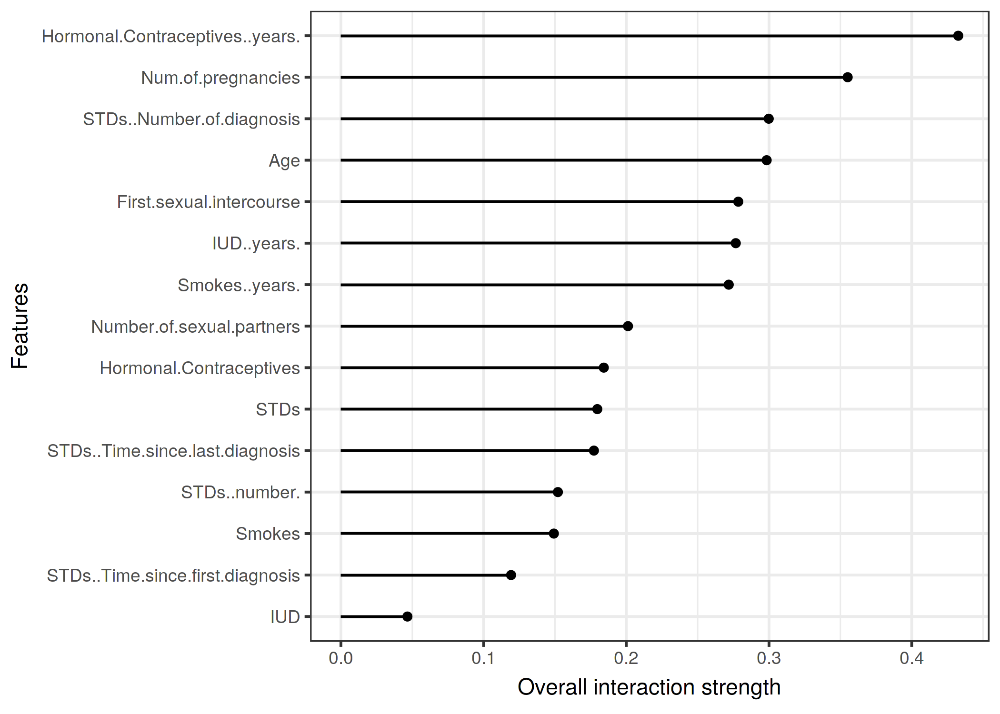
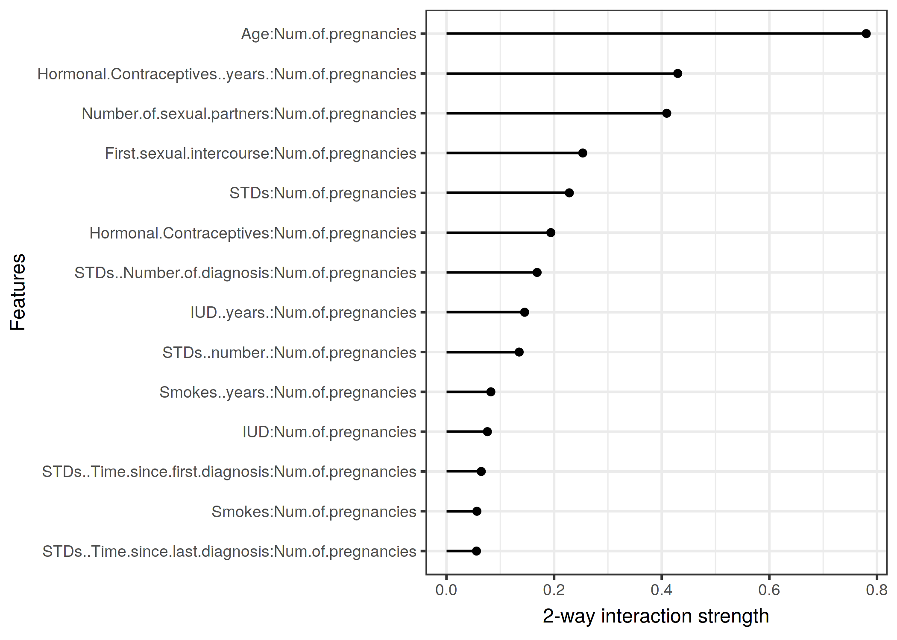

## Material is on my GitHub

- URL
- slides, `R` code, and data hosted here

## Credit where it's due

(Most) content from *Interpretable Machine Learning: a guide for making black box models explainable* by Christoph Molnar

{ width=50% .centered}


## Machine Learning

The IML book focuses supervised learning, which maps features to outcomes

- **Features**: Variables or covariates, the columns in a dataset
- **Instance**: a row in the dataset, all feature values that go with one observation
- **Learner**: the machine learning algorithm, a program used to learn an ML model from data
- **ML Model**: program that maps inputs to predictions, i.e. weights for a linear model or neural network
- **ML Task**: regression, classification, clustering, survival analysis are example tasks


## Importance of interpretability

Interpretability is the degree to which a human can understand the cause of a decision or consistently predict a model's result, the **how** and **why** a decision was reached.

* Helps us understand when models might fail
* Helps us understand mechanisms behind predictions

* Both crucial for biomedical applications

## Evaluation of interpretability

- **Accuracy**: if the explanation replaces the original model, can it still give good predictions on new data?
- **Fidelity**: how well does the explanation approximate the prediction of the black box model?
- **Consistency**: how much does an explanation differ between models trained for the same task?
- **Stability**: are the explanations for similar instances similar?
- **Comprehensibility**: can people understand the explanation?
- **Certainty**: does it reflect variability in the prediction?
- **Degree of Importance**: if multiple variables go into an explanation, is it clear which are most important?
- **Representativeness**: does it cover predictions from the whole model, or just individual predictions?

## Example data: risk factors for cervical cancer

- binary classification task, indicators and risk factors for cervical cancer
- data from UCI machine learning repository

```{r, include=FALSE}
library(here)
load(here("data/cervical.RData"))
```

- `r nrow(cervical)` subjects
- `r ncol(cervical)` variables
- `Biopsy` is the outcome variable

```{r}
table(cervical$Biopsy)
```


## Example data: bike share rentals in D.C.

- regression task, goal is to predict how many bikes will be rented depending on the weather and the day

```{r, include=FALSE}
library(here)
load(here("data/bike.RData"))
```

- `r nrow(bike)` subjects, `r ncol(bike)` variables
- `cnt` is the outcome variable

```{r, message = FALSE, echo = FALSE}
library(tidyverse)

bike %>% 
  ggplot(aes(temp, cnt, color = season)) + 
  theme_bw() +
  geom_point()
```

The seasons in this plot don't make sense.

## Naturally interpretable models

- **Decision trees**:
- **Linear regression**:
- **Logistic regression**:
- **GLMs and GAMs**:

- Have modeling assumptions that are often violated in practice
- Don't always give great predictions

We're not gonna focus on these (also, are GAMs that easy to interpret anyway??)


## What are model-agnostic methods?

- Methods that can be used with any ML model, or at least don't require you to choose one specific model 
- These are *post hoc* methods (interpretation methods are applied after the model is trained)

{ width=40%}

## Training a classifier for cervical cancer

I will use the cervical cancer classification task as an example. Code below uses a random forest model to classify patient's by cervical cancer status.

```{r}
library(mlr)
library(iml)

task = makeClassifTask(data = cervical, 
                       target = "Biopsy")
learner = mlr::makeLearner(cl = 'classif.randomForest', 
                           id = 'cervical-rf', 
                           predict.type = 'prob')
mod = mlr::train(learner, task)


pred.cervical = iml::Predictor$new(mod, data = cervical, class = "Cancer")
```

## Classification results

- Extremely poor sensitivity
- Need to deal with class imbalance

```{r}
mod$learner.model
```

## Partial Dependence Plot (PDP)

- marginal effect one or two features have on the outcome
- shows nature of relationship (linear, quadratic, more complex)
- global method (focuses on overall average)

<div class="green">
- clear interpretation: how the average prediction changes when the j-th feature is changed
- easy to implement
</div>
<div class="red2">
- hard to visualize more than 2 features at once
- doesn't show feature distribution (can over interpret areas with little data)
- **assumes independence** of features, often violated in practice 
</div>
- alternatives are ICEs and ALEs

## Example PDPs

- for age, probability is low until 40 then increases
- like a PDP for observation-level data

```{r pdp-cervical, echo = FALSE, message = FALSE}
pdp = FeatureEffect$new(pred.cervical, "Age", method = "pdp") 
p1 = pdp$plot() + 
  scale_x_continuous(limits = c(0, NA)) + 
  scale_y_continuous('Predicted cancer probability', limits = c(0, 0.4))

pdp$set.feature("Hormonal.Contraceptives..years.")
p2 = pdp$plot() + 
  scale_x_continuous("Years on hormonal contraceptives", limits = c(0, NA)) + 
  scale_y_continuous('', limits = c(0, 0.4))
gridExtra::grid.arrange(p1, p2, ncol = 2)
```

## Individual Conditional Expectation (ICE)

- for each instance, shows how the instance's prediction changes when a feature changes
- PDP is average of the lines for an ICE plot

<div class="green">
- intuitive to understand
- can uncover heterogeneous relationships that PDP cannot
</div>
<div class="red2">
- can only visualize 1 feature at a time
- still **assumes independence** of features
</div>

## Example ICEs

- overall cancer probability increases around 50, but less so for women with a high overall probability

```{r ice-cervical, echo = FALSE, message = FALSE}
data(cervical)
set.seed(43)
cervical_subset_index = sample(1:nrow(cervical), size = 300)
cervical_subset = cervical[cervical_subset_index, ]
cervical.task = makeClassifTask(data = cervical, target = "Biopsy")
mod = mlr::train(mlr::makeLearner(cl = 'classif.randomForest', id = 'cervical-rf', predict.type = 'prob'), cervical.task)
pred.cervical = Predictor$new(mod, cervical_subset, class = "Cancer")
ice = FeatureEffect$new(pred.cervical, "Age", method = "ice")$plot() + 
  scale_color_discrete(guide='none') + 
  scale_y_continuous('Predicted cancer probability')
ice
```


## Accumulated Local Effects (ALE)

- how features influence the prediction of an algorithm on average
- faster and unbiased alternative to PDPs (book has a nice explanation as to why)
  - Change in prediction due to local change in the value of a feature
- interpretation: relative effect of changing a feature value at a particular location

<div class="green">
- unbiased (still works when features are correlated)
- easy to implement
</div>
<div class="red2">
- doesn't work for categorical features without natural ordering
- can be noisy/unstable
- no ICE curve equivalent
</div>
- use ALE instead of PDP as rule of thumb


## Example ALES

ALE plots for the effect of age and years with hormonal contraceptives on the predicted probability of cervical cancer

```{r ale, echo = FALSE, message = FALSE}
ale1 = FeatureEffect$new(pred.cervical, "Age", method = "ale")$plot()
ale2 = FeatureEffect$new(pred.cervical, "Hormonal.Contraceptives..years.", method = "ale")$plot() +
  scale_x_continuous("Years with hormonal contraceptives") + 
  scale_y_continuous("")
gridExtra::grid.arrange(ale1, ale2, ncol = 2)
```


## Feature interaction

- **H-statistic**: measures interaction strength 
- often used to measure (1) interaction between two features or (2) interaction between one feature and all others 

<div class="green">
- meaningful interpretation (share of variance interaction explains)
- comparable across features and models
- can be used for multiple forms of interactions
</div>
<div class="red2">
- takes forever to compute
- value can be greater than 1, which is weird
- not useful for an image classifier
- assumptions can be violated if features correlate strongly
</div>


## Example interactions

* Interaction strength for each feature with all other features
* x-axis is amount variance explained by interaction

```{r interaction-cervical-include, echo = FALSE,  out.width = "600px"}

```

## Example two-way interactions

* Strength of two-way interaction between number of pregnancies and all other variables

```{r, echo = FALSE,  out.width = "600px"}

```


## Permutation feature importance

- measures the increase in the prediction error of the model after we permuted the feature’s values
- originated for random forests (variable importance)
- fit on test or training data? (it depends)

<div class="green">
- **interpretation**: increase in the model error when the feature's information is destroyed
- global insight into model's behavior
- takes into account interactions with other features
</div>
<div class="red2">
- unclear whether to use training or test data
- need to know true (labeled) outcome value
- permutation adds randomness so results might vary greatly
- correlated features can generate bias (and split importance between correlated features)
</div>


## Feature importance plot


```{r, echo = FALSE, message = FALSE}
predictor = Predictor$new(mod, data = cervical[-which(names(cervical) == "Biopsy")], y = (cervical$Biopsy == "Cancer"), class = "Cancer")
auc_error = function(actual, predicted) 1 - Metrics::auc(actual, predicted)
importance = FeatureImp$new(predictor, loss = auc_error)
imp.dat = data.frame(importance$results[c("feature", "permutation.error", "importance")])
most_imp = imp.dat$feature[imp.dat$importance == max(imp.dat$importance)]

plot(importance) +
  scale_x_continuous("Feature importance (loss: 1 - AUC)") +
   scale_y_discrete("")
```

## Global surrogate

## Global surrogate 

```{r, echo = FALSE, message = FALSE, warning = FALSE}
pred.cervical = Predictor$new(mod, data = cervical[names(cervical) != "Biopsy"], type = "prob")
tree.cervical = TreeSurrogate$new(pred.cervical, maxdepth = 2) 
plot(tree.cervical) + 
	theme(strip.text.x = element_text(size = 8))
pred.tree.cervical  = predict(tree.cervical, cervical)["Cancer"]
pred.cervical = getPredictionProbabilities(predict(mod, task))
```


## Local surrogate (LIME)

## Local surrogate (LIME)

## Scoped rules (Anchors)

## Scoped rules (Anchors)

## Shapley values

## SHAP

## Example based explanations

Only include this if it seems important

## Neural Network interpretation

# Thanks!

- website


